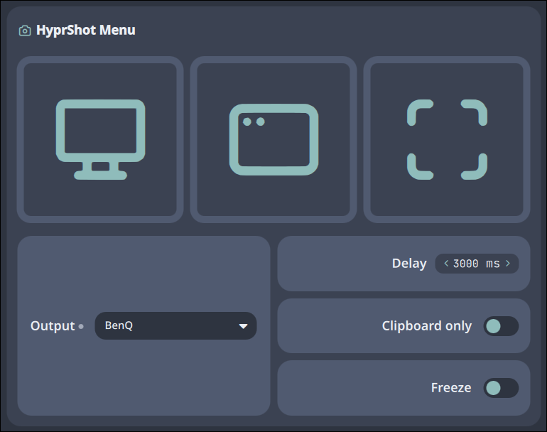

# Hyprshot Menu

A GUI to do several kinds of screenshots with hyprshot.



## Features

- **Screen print**: Run hyprshot with some settings.
- **Mode selector**: Choose between Output/Window/Area to make screenshot.
- **Fast action**: Middle-click the bar widget to run hyprshot with a pre-selected mode and no delays.
- **Output detector**: Program auto-detects your display outputs, and can be manually declared too.
- **Panel avoidance**: Noctalia's panel can have animations, the plugin detects animation duration to wait before running.

## IPC Commands

You can control the plugin via the command line using the Noctalia IPC interface.

### General Usage
```bash
qs -c noctalia-shell ipc call plugin:hyprshot-menu <command>
```

### Available Commands

| Command  | Description                                          | Example                                                     |
|----------|------------------------------------------------------|-------------------------------------------------------------|
| `toggle` | Opens or closes the panel on the current screen      | `qs -c noctalia-shell ipc call plugin:hyprshot-menu toggle` |
| `shot`   | Runs hyprshot with a pre-selected mode and no delays | `qs -c noctalia-shell ipc call plugin:hyprshot-menu shot`   |


## Settings

| Setting           | Default                               | Description                                                                                    |
|-------------------|---------------------------------------|------------------------------------------------------------------------------------------------|
| `mode`            | `region`                              | Mode to use in fast-action                                                                     |
| `folder`          | `$HOME`                               | Folder where to save screenshots                                                               |
| `filename`        | `ScreenShot`                          | Base name of screenshots (datetime is appended)                                                |
| `freeze`          | false                                 | Wether to freeze screen when selecting area to screenshot                                      |
| `notification_ms` | 5000                                  | Duration of the notification after screenshot                                                  |
| `delay_ms`        | 400                                   | Delay before making the screenshot (added to delay necessary to avoid plugin panel hiding)     |
| `no_save`         | false                                 | Wether to save the screenshot to `folder` or only into clipboard                               |
| `outputs`         | `empty array`                         | List of `output` to choose from when selecting the mode                                        |
| `output`          | `{"key": "active", "name": "Active"}` | Output from `outputs` to use when using output mode (`active` means the focused display output) |
| `output.key`      |                                       | Output key (e.g. DP-1, HDMI-A-1)                                                               |
| `output.name`     |                                       | User declared name for the output to better identify it.                                       |

To list every output available in your system, you can run `hyprctl monitors all` and copy the output names into the `outputs` setting.

### Example of `outputs` setting:

```json
[
    {"key": "active", "name": "Active"},
    {"key": "DP-1", "name": "Work Monitor"},
    {"key": "HDMI-A-1", "name": "TV"}
]
```

## Dependencies

- **Hyprshot**: A screen printer tool for Hyprland.