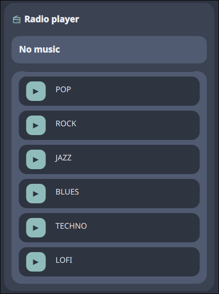

# Radio player

A radio player widget that lets you listen to any radio station online from a custom list.



## Features

- **Custom list**: Create your own custom list of radios for quick access.
- **Currently playing**: A bar showing currently playing music if data is available.
- **Import/Export**: Export your list directly to your clipboard in JSON format. Import it later or share with friends.

## IPC Commands

You can control the plugin via the command line using the Noctalia IPC interface.

### General Usage
```bash
qs -c noctalia-shell ipc call plugin:radio-player <command>
```

### Available Commands

| Command     | Description                                      | Example                                                         |
|-------------|--------------------------------------------------|-----------------------------------------------------------------|
| `toggle`    | Opens or closes the panel on the current screen  | `qs -c noctalia-shell ipc call plugin:radio-player toggle` |


## Settings

| Setting                   | Default      | Description                         |
|---------------------------|--------------|-------------------------------------|
| `radioList`               | `empty list` | An array of radios                  |
| `radioList.name`          |        | Name of radio to show in plugin     |
| `radioList.url`           |         | URL from where to fetch radio music |

### Example of `radioList` setting:
```json
[
    {
        "name": "Radio Paradise",
        "url": "http://stream-tx3.radioparadise.com/aac-128"
    }
]
```
